# 💻 Desafio de Automação de Switch Cisco com Interface Gráfica
## Parte 1

Este projeto foi desenvolvido como parte de um processo seletivo, com o objetivo de aplicar conceitos de automação de redes, integração com dispositivos Cisco e uso de interface gráfica com Python. A proposta contempla a criação de VLANs, alteração de hostname, backup da configuração do switch e validação da configuração.

---
🧠 Autor
Rosner Pelaes Nascimento

---

## 🎯 Objetivo do Desafio

O desafio técnico foi dividido em etapas com os seguintes requisitos:

- Desenvolver uma interface gráfica (GUI) para entrada de dados.
- Realizar conexão com switches Cisco via SSH.
- Criar VLANs e nomeá-las conforme especificado:
  - VLAN 10 - VLAN_DADOS
  - VLAN 20 - VLAN_VOZ
  - VLAN 50 - VLAN_SEGURANÇA
- Alterar o hostname do switch para `SWITCH_AUTOMATIZADO`.
- Salvar a configuração no equipamento.
- Realizar backup local da configuração (`running-config`) com timestamp.
- Validar se a configuração foi aplicada corretamente (hostname e VLANs).
- Utilizar controle de versão com Git.
- Incluir evidências de testes e organização do projeto no repositório.

---

## 🧰 Ferramentas Utilizadas

| Ferramenta     | Finalidade                                          |
|----------------|-----------------------------------------------------|
| GNS3           | Simulação da topologia com dispositivos Cisco       |
| VMWare         | Virtualização do ambiente de testes                 |
| Visual Studio Code | Desenvolvimento do código Python                  |
| Cisco (emulado) | Equipamento simulado para testes de automação    |
| Python 3.13.5  | Linguagem utilizada no desenvolvimento dos scripts  |

---

## 🐍 Instalação das Dependências Python e Ambiente Virtual

Antes de executar o projeto, configure um ambiente virtual e instale as bibliotecas necessárias utilizando o comando abaixo:

```
python3 -m venv venv
.\venv\Scripts\activate
pip install netmiko
````
## 🚀 Como Executar o Projeto
1. Clone o repositório:
```
https://github.com/RosnerTech/desafio-automacao-meli.git
```
2. Execute o script principal:
```
python app_cisco.py
```

## 🧪 Testes e Evidências

As imagens abaixo demonstram a execução da aplicação, com o funcionamento da interface gráfica e os testes feitos com o switch emulado.

<p align="center">
 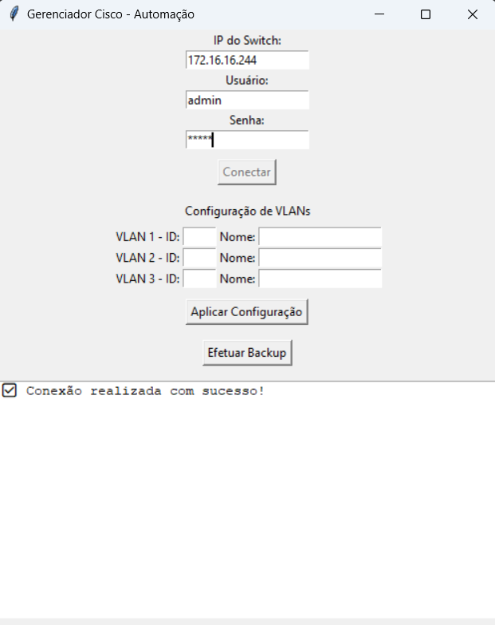 
  <br>
  <em>Conexão com Switch.</em>
</p>

<p align="center">
 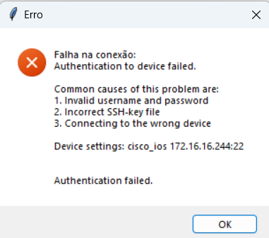 
  <br>
  <em>Em caso de erro apresenta mensagem.</em>
</p>

<p align="center">
 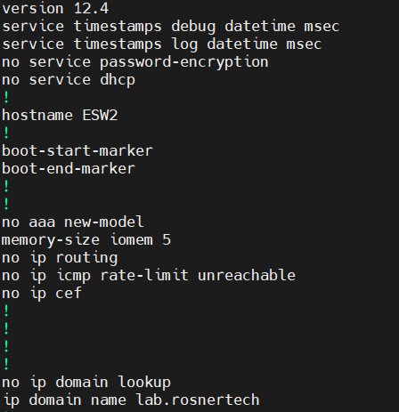 
  <br>
  <em>Hostname inicial do Switch antes da execução do script.</em>
</p>

<p align="center">
 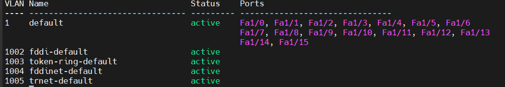 
  <br>
  <em>Vlan default do Switch antes da execução do script.</em>
</p>

<p align="center">
 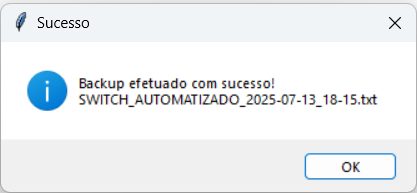 
  <br>
  <em>Sucesso execução do Backup.</em>
</p>

<p align="center">
  <em>Arquivo na raiz do repositório SWITCH_AUTOMATIZADO_2025-07-13_18-15.txt</em>
</p>

<p align="center">
 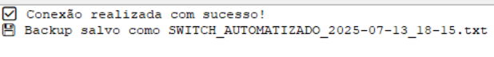 
  <br>
  <em>Log que aplicação exibe para o usuário.</em>
</p>

<p align="center">
 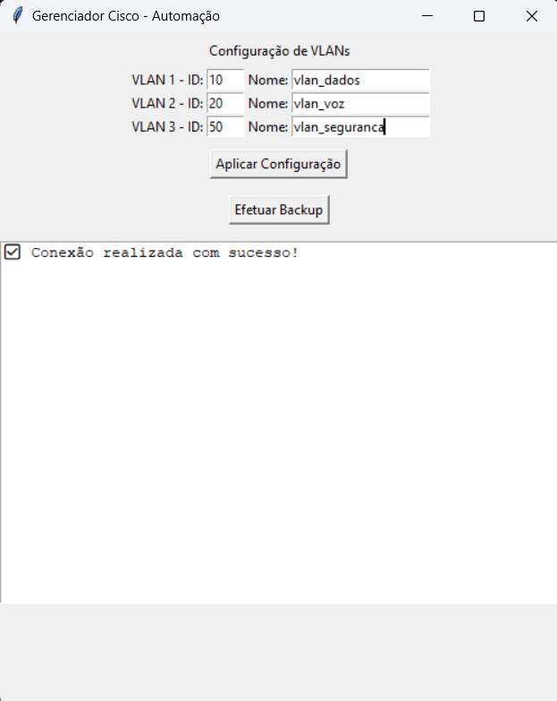 
  <br>
  <em>Preenchendo informações das VLANs.</em>
</p>

<p align="center">
 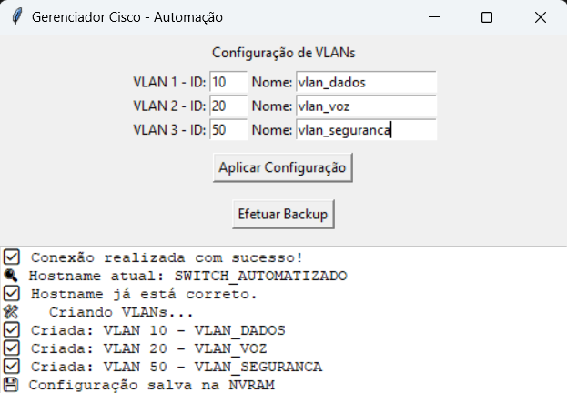 
  <br>
  <em>Criando as VLANs.</em>
</p>

<p align="center">
 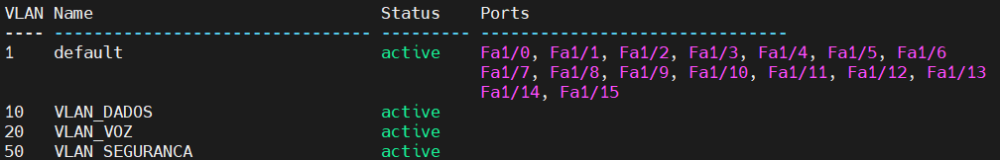 
  <br>
  <em>Validando VLANs no Switch.</em>
</p>

<p align="center">
 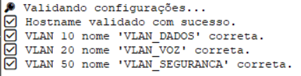 
  <br>
  <em>Log de validadação das VLANs.</em>
</p>

<p align="center">
 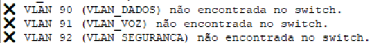 
  <br>
  <em>Log de erro na validação das VLANs.</em>
  <br>
  <em>Aqui simulei um erro para demonstrar a mensagem de erro.</em>
</p>


<p align="center">
 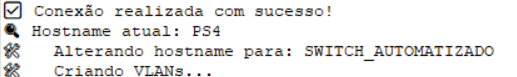 
  <br>
  <em>Valida o Hostname e altera em caso incorreto.</em>
  <br>
  <em>Alterei o hostname no Switch e executei o script, para demonstrar a verificação e alteração do hostname.</em>
</p>

## 🔍 Demonstração em vídeo do resultado final da funcionalidade desenvolvida.

<div align="center">
  <h2>
    <a href="https://www.youtube.com/watch?v=NoaW00q5pgU" target="_blank">
      ▶️ Assista agora no YouTube
    </a>
  </h2>
</div>

## Parte 2

# Plano de Automação - VPN IPSec entre FortiGate e Palo Alto

## 📚 Objetivo

Automatizar a configuração de uma VPN IPSec entre um firewall **FortiGate** (7.0.4, GNS3) e um firewall **Palo Alto** (não emulado), utilizando:

- API REST do FortiGate (com token de acesso)
- Conexão SSH (prevista para o Palo Alto)

Este documento descreve:

- Parâmetros da VPN
- Ferramentas e bibliotecas utilizadas
- Passos para automação
- Considerações técnicas
- Scripts utilizados
- Validação da configuração
---
## 📌 Parâmetros da VPN

| Item                 | Valor                    |             
| -------------------- | ------------------------ |
| Nome do túnel        | VPN-FGT-PA               |             
| IP WAN FortiGate     | 172.16.16.246            |             
| IP WAN Palo Alto     | 172.16.16.247            |             
| Rede local FortiGate | 192.168.10.0/24          |             
| Rede local Palo Alto | 192.168.20.0/24          |             
| IP túnel FortiGate   | 169.255.1.1              |             
| IP túnel Palo Alto   | 169.255.1.2              |
| PSK (chave secreta)  | SuperSecret123!          |             
| Versão IKE           | IKEv2                    |             
| Propostas Phase 1    | AES-256 / SHA-256 / DH14 |             
| Propostas Phase 2    | AES-256 / SHA-256 / DH14 |             

---

## 🪧 Ferramentas e APIs

### FortiGate:

<div align="left">
  <h2>
    <a href="https://docs.fortinet.com/document/fortigate/7.4.0/administration-guide/954635/getting-started" target="_blank">
      📖 FortiOS REST API
    </a>
  </h2>
</div>

- **API REST v2** (ativa por token)
- Requisições `POST`, `PUT` para configuração de IPsec e interfaces
- Biblioteca Python: `requests`

### Palo Alto:

<div align="left">
  <h2>
    <a href="https://docs.paloaltonetworks.com/" target="_blank">
      📖 PAN-OS API
    </a>
  </h2>
</div>

- **API REST (XML/JSON)**
- Endpoint: http://172.16.16.247/api/?type=config&action=set
- Comandos CLI para criação de túnel e IKE/IPSec

---

## ⚖️ Passos para automação

### 1. FortiGate (API):

#### Coletar Parâmetros:

- Ler variáveis (IPs, algoritmos, redes locais) configurado no script.

#### Configurar Fortigate:

- Criar interface de túnel (`169.255.1.1/30`).
- Definir Phase 1 e Phase 2.
- Criar política de firewall para permitir tráfego VPN.

#### Configurar Palo Alto:

- Criar interface de túnel (`169.255.1.2/30`).
- Configurar IKE Gateway e IPSec Crypto Profile.
- Adicionar regra de segurança para o tráfego VPN.

## ⚡ Script utilizado - Palo Alto (Python) - Não foi possível emular o ambiente.
Script no repositário - paloalto_config_vpn.py

#### Estabelecer o Túnel:

- Iniciar a VPN em ambos os lados e verificar status.

---
## ⚡ Script utilizado - FortiGate (Python)
Script no repositário - fortigate_config_vpn.py

<p align="center">
 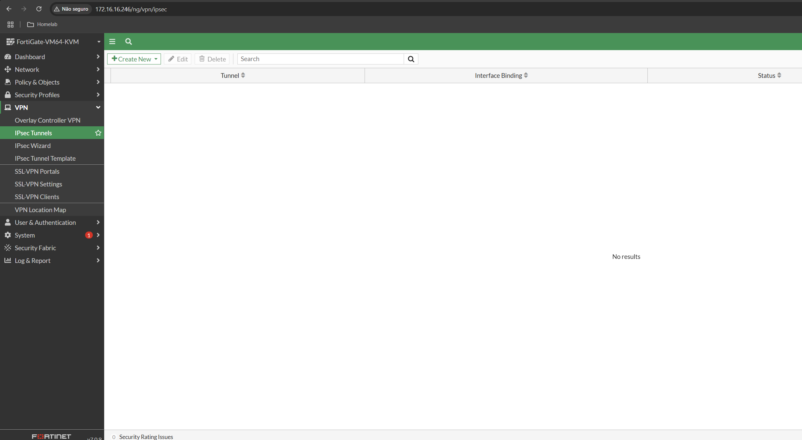 
  <br>
  <em>Fortigate sem configuração Ipsec.</em>
  </p>

  <p align="center">
 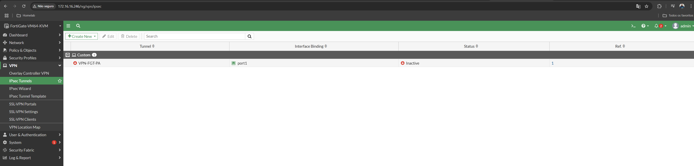 
  <br>
  <em>Fortigate com configuração Ipsec.</em>
  </p>

<p align="center">
 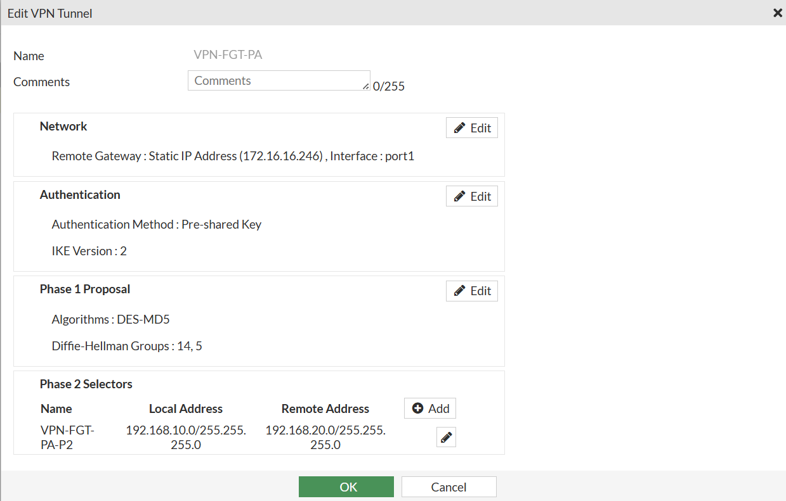 
  <br>
  <em>Fortigate com configuração Ipsec.</em>
  <br>
  <em>Durante o teste acabei utilizando IP diferente da documentação.</em>
  </p>

---

  <p align="center">
  
  <br>
  <em>Aviso do sucesso do script.</em>
  </p>

---

## 📊 Validação da configuração

### FortiGate:

- Execute diagnose vpn tunnel list para verificar se o túnel IPSec foi criado corretamente e se encontra-se em estado "up".
- Utilize get router info routing-table all para confirmar a presença de rotas associadas à interface do túnel.
- Realize uma chamada GET para o endpoint /api/v2/monitor/system/status para checar o estado geral do sistema.
- Alternativamente, verifique o status da VPN com /api/v2/monitor/vpn/ipsec/
- Chamada GET: `/api/v2/monitor/system/status`

 <p align="center">
 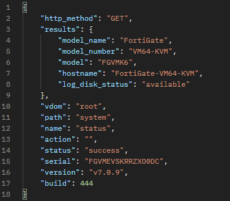 
  <br>
  <em>Validação da API.</em>
  </p>

### Palo Alto:
Obs: Não foi possível  emular o ambiente do Palo Alto
- Use show vpn ike-sa para verificar o estado das negociações IKE.
- Utilize show vpn ipsec-sa para validar o estabelecimento do túnel IPSec.
- Confirme se a interface tunnel.1 está com o IP 169.255.1.2/30 e acessível via ping interno.

---

## 💡 Considerações específicas

Durante o desenvolvimento do script em Python para configurar VPN IPsec, consegui realizar os testes com sucesso utilizando o FortiGate emulado no GNS3. A API da Fortinet exige autenticação via token ou sessão, o que foi devidamente tratado no script.

No entanto, enfrentei dificuldades para testar com o Palo Alto, principalmente pela falta de experiência avançada na plataforma e limitações na emulação no GNS3. Além disso, o uso de SSH no Palo Alto não fornece feedback claro de erro, exigindo validações manuais no script, o que aumenta a complexidade.

Outro ponto foi a utilização do mesmo IP WAN (172.16.16.246) em ambos os lados da VPN no ambiente simulado, algo que causaria conflito em ambiente real.

Cada fabricante adota lógica distinta para as fases da VPN, exigindo personalização no processo de automação. Esses fatores reforçam a complexidade ao lidar com múltiplos fabricantes e destacam a importância de conhecer bem cada plataforma envolvida.

---